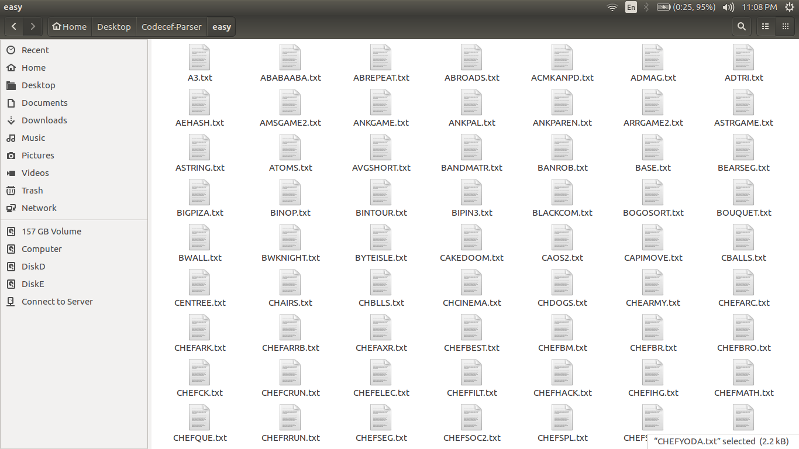
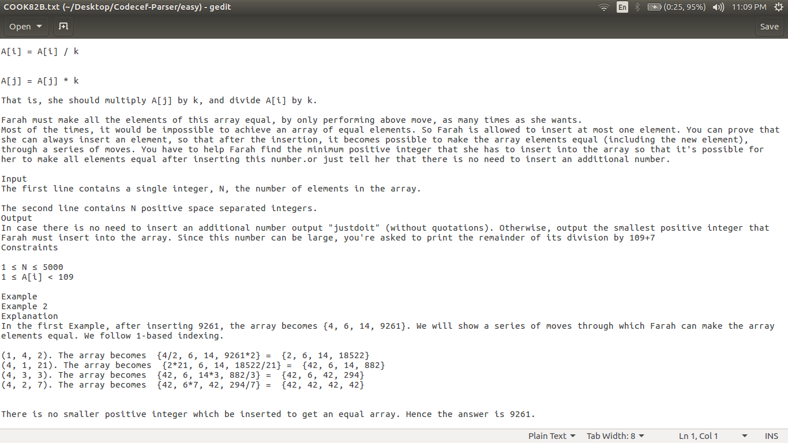
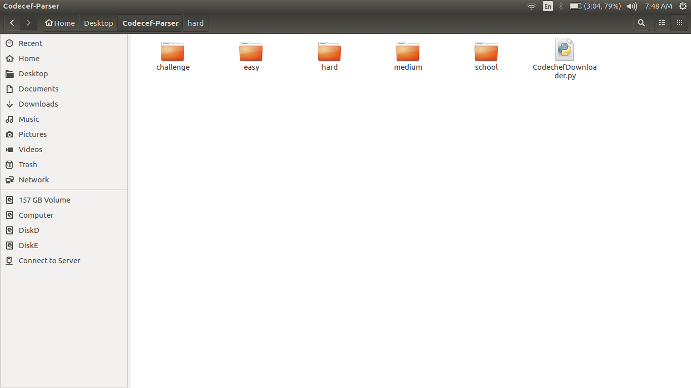

# Codechef-Problem-Statement-Downloader

This is the script that I have used to download the codechef problem statements.

Omkar Pathak, 
Pune, Maharashtra, India. 

## Requirements

* **Beautiful Soup Module**
    * If you are using Debian or any Debian based Linux distro such as Ubuntu then you can install Beautiful Soup by
    typing `apt-get install python-bs4` (for Python 2) or `apt-get install python3-bs4` (for Python 3)
    * If you prefer downloading via pip you can download it by executing these commands:
    `pip install beautifulsoup4` (for Python 2) or `pip3 install beautifulsoup4` (for Python 3)

* **urllib.request module**
    * This module is built-in for Python 3
    * Python 2 users can use urllib2 in the program

## How to Use

* Download or fork the repository.
* Make sure all the requirements are satisfied.
* Run the application by executing `python3 CodechefProblemStatementDownloader.py` command in your terminal.

# Working

* Each problem statement gets downloaded and is written in a text file. The file is named according to the code name given by the codechef.

* Each file contains the problem statement as described on the codechef website

* Problem statements are arranged according to their level. Beginner (School), easy , medium, hard, challenge, peer (extcontest) are the levels defined by codechef

# Todo
- [X] Add the progess bar for downloads.
- [ ] Improve the overall execution using multitasking.
